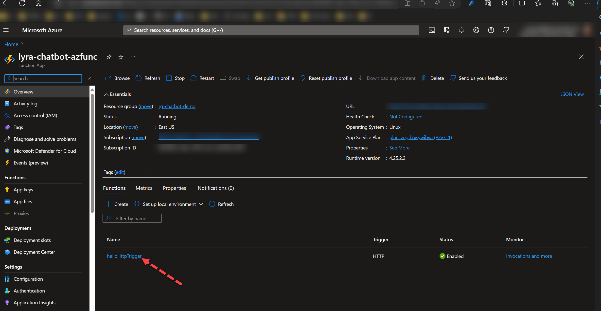
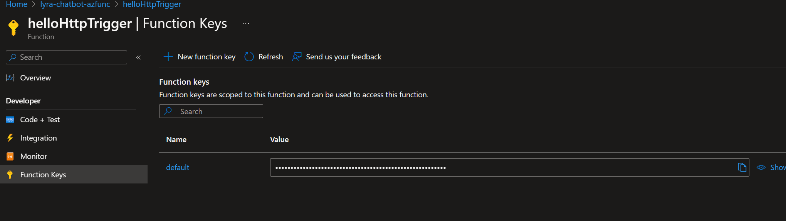

# Overview

This is a very simple Http Trigger Azure Function app that has no other bindings other than accepting an Http trigger

## Clone the repo and build

Ensure you have NodeJS 18+ installed with npm:

```bash
npm run build
```

## Install the Azure Functions Core tools

If you want to test locally or run the `func` cli tool install the [Azure Functions Core tools](https://learn.microsoft.com/en-us/azure/azure-functions/functions-run-local?tabs=windows%2Cisolated-process%2Cnode-v4%2Cpython-v2%2Chttp-trigger%2Ccontainer-apps&pivots=programming-language-csharp#install-the-azure-functions-core-tools)


## Calling

This requires a function key, so ensure you use the function key assigned or admin key from the App Portal

Portal:




### Using the URL parameter:

```bash
GET https://your-function-app-name.azurewebsites.net/api/hellohttptrigger?code=APIKEY
x-functions-key: APIKEY
```

### Using the HTTP Header:

```bash
GET https://your-function-app-name.azurewebsites.net/api/hellohttptrigger
x-function: APIKEY
```

## Deployment via `func` tool

After installing the Azure Core Function tools you can use the `func` cli option that will zip and upload in one step:

```shell
func azure functionapp publish lyra-chatbot-azfunc --show-keys --force --build remote
```

## Deployment via `az cli`

The `az cli` method requires zipping up the necessary files needed to deploy.
### Zipping contents

use the following command to ensure you only include the necessary files in the zip

```bash
find . -type f | grep -v -f .funcignore | zip deploy.zip -@
```

>NOTE: when using PowerShell it MUST be version 7.x+

```powershell
# Define the source directory, the destination zip file, and the ignore file
$sourceDir = "."  # Adjust this to your source directory path
$destinationZip = ".\deploy.zip"
$ignoreFile = ".\.funcignore"

# Read the ignore patterns from the ignore file
$ignorePatterns = Get-Content $ignoreFile

# Get all files in the source directory
$allFiles = Get-ChildItem -Path $sourceDir -Recurse -File

# Filter out the ignored files
$filesToZip = $allFiles | Where-Object {
    $currentFile = $_.FullName
    $exclude = $false

    foreach ($pattern in $ignorePatterns) {
        if ($currentFile -like "*$pattern*") {
            $exclude = $true
            break
        }
    }

    -not $exclude
}

# Create the zip archive
Compress-Archive -Path $filesToZip.FullName -DestinationPath $destinationZip

```

### Deployment

Then using the `az cli`:

```bash
az functionapp deploy --clean true --restart true --src-path ./deploy.zip -n "lyra-chatbot-azfunc" -g "rg-chatbot-demo"
```
